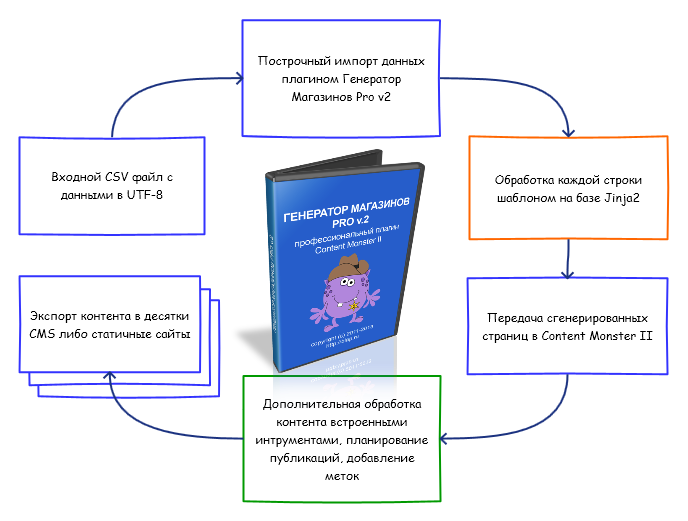

.. header:: Content Monster 2
.. |date| date:: %Y
.. |copy| unicode:: 0xA9 .. copyright sign
.. footer:: |copy| |date| Генератор магазинов Pro v2

Плагин "Генератор магазинов Pro v2"
===================================

Генератор Магазинов Pro v2 [1]_ – это профессиональный плагин к генератору сайтов Content Monter II [2]_.

Основное предназначение плагина
-------------------------------

1. Генерация уникального, 100% читабельного контента, на основе входящих данных
2. Разворачивание цифровых констант в обширные текстовые описания
3. Генерация недостающего контента на сайте для внутренней перелинковки
4. Создание разделов сайта для поднятия  трафика

Схема работы плагина
--------------------

1. Плагин на входе получает CSV файл в кодировке UTF-8. Данный CSV файл можно сгенерировать практически любым парсером, либо воспользоваться нашим парсером Ютуба [4]_ для генерации видео сайтов или разделов с видео на сайте.

2. Входной CSV файл построчно обрабатывается плагином на основе заданного темплейта. Все темплейты построены на базе шаблонизатора Jinja2. Уже на этой стадии темплейтами достигается 95-100% уникальность контента.

3. Сгенерированные страницы передаются непосредственно в Content Monster II, где полученный контент обрабатывается сотнями различных вариантов: дополнительно уникализируется Gobo базами, синонимизируется, осуществляется перелинковка, планирование публикаций, формирование меток, SEO обработка текста, всевозможные замены, генерация вступлений и их уникализация, внедрение дополнительных изображений и т.д.

4. Сформированный сайт разносится по разделам и выгружается в десятки разнообразных CMS либо генерируется статичный сайт.

Быстрый старт
-------------

Для того чтобы быстро разобраться с генератором магазинов PRO предлагаем Вам ознакомится с полностью настроенными темплейтами.
В комплектах идет входная база на тысячи строк, непосредственно плагин Генератора Магазинов PRO, предустановленный темплейт.
На основе этого `рабочего примера <http://www.plati.ru/asp/pay.asp?idd=1449049>`_ вы можете сразу сгенерировать полнофункциональный уникальный сайт.

.. note::
	В наличии есть широкий выбор подобных баз. Кроме того, Вы всегда можете заказать уникальную базу, собранную и настроенную под вас.Для этого отпишите Ваши пожелания в контактной форме `Заказ уникальной базы <http://blap.ru/kontakty/>`_.

Краткий обзор возможностей темплейтов
~~~~~~~~~~~~~~~~~~~~~~~~~~~~~~~~~~~~~

Конструкция указывает, что нам нужно вывести (подставить данные) из 1 и 8 поля подготовленного csv файла, разделив их двоеточием. Поля в csv файле начинаются с 0 `{{ data.1 }} : {{ data.8 }}`.

Так, для csv файла, сгенерированного парсером ютуба, в первом поле хранится имя видео файла (название), в восьмом – запрос, по которому было найдено это видео. На выходе это будет выглядеть вот так::

	Уроки игры на гитаре для начинающих (Часть 1) : "как играть на гитаре"

Рассмотрим следующий блок::

	{{ choice(["Дата публикации","Дата"]) }}: {{ data.3 }} 

Функцией `choice` мы выводим 1 значение из списка (здесь их 2, но можно ставить сколько угодно "Дата публикации","Дата"). Тем самым мы добиваемся уникальности этой строки в пределах сайта. Обязательно расширяйте список!

Следующая конструкция::

	{{ choice(["Рейтинг","Оценка"]) }}: {{ data.4 }} {{ choice(["","баллов","*","звезд"]) }}

Здесь мы выводим рейтинг видео по версии Ютуба. На выходе могут быть такие значения::

	Оценка: 4.899371 *
	Рейтинг: 4.899371 баллов

Чтобы корректно обработать склонения/спряжения слова баллов, вы можете подключить словарь на поле `{{ data.4 }}`, как это сделать – см. далее::

	Длительность:
	

Задаем переменную egg и присваиваем целочисленное значение от 1 до 2::

	{{ data.6 }} секунд

Если egg равно 1, то просто выводим поле 6, где хранится значение длительности ролика в секундах::

	

В противном случае::

	

Присваиваем переменной spam длительность в секундах и накладываем фильтр `data.6|int`, преобразующее значение в целое число::

	

Делим нацело значение переменной spam на 60 (получаем минуты)::

	{%- set s = spam%60 -%}

Вычисляем секунды::

	{{ m }}:{{ "%02i"|format(s) }}
	

Выводим минуты и секунды, накладывая фильтр. Выглядит это так::

	Длительность:9:08

Все остальное – аналогично.

Разберем еще один блок::

    {{ choice(["новый","свежий","интересный","забавный","",""]) }}
    {{[choice(["он лайн","онлайн","он-лайн","online",""]),
    choice(["видео",""]),"ролик"]|shuffle|join(" ")}}

Здесь нам интересен фильтр `shuffle`, который произвольно перемешивает список, при этом список в свою очередь порождается из случайно выбранных значений списка (вложенная функция `choice`).
Далее список объединяется фильтром `join(" ")` через пробел.

На выходе могут быть такие значения::

	ролик видео онлайн
	он-лайн ролик видео
	интересный online  ролик
	забавный  ролик он-лайн

Таким образом, манипулируя темплейтом, можно получать уникальные тематические описания какого угодно размера и степени уникальности.

Разберем последний интересный блок темплейта, отвечающий за вывод комментариев. Комментарии хранятся в полях, начиная с 9 и заранее не известно, сколько их там находится::

	
	
	
	<li>{{ c|yasyn("internal", 3) }}</li>
	
	

Здесь мы определяем число полей в csv с комментариями (начиная с 9 поля) и в обычном цикле выводим комментари в виде списка.

Обратите внимание, что сам комментарий мы обрабатываем встроенным синонимайзером `yasyn`, при этом заменяем каждое третье слово::

	{{ c|yasyn("internal", 3) }}

Мы можем использовать как встроенные словари, так и любые внешние. См. далее в помощи по фильтрам_.

Синтаксис
~~~~~~~~~

Генератор магазинов PRO v2 для генерирования контента использует технологию Jinja2 [3]_.

Это пример шаблона::

    <ul id="navigation">
    
        <li><a href="{{ item.href }}">{{ item.caption }}</a></li>
    
    </ul>

Применяются два типа разделителей. ```` и ``{{ ... }}``.  Первый, для
блочных тегов, таких как ``for`` и ``if``, второй, для переменных.

Переменные
~~~~~~~~~~

Во время генерации статей плагин построчно передает в шаблон переменную ``data``, содержащую
список.

Для доступа к атрибутам либо переменным используется точка (``.``). Кроме того
возможно использованием квадратных скобок (``[]``). Следующие строки идентичны::

    {{ foo.bar }}
    {{ foo['bar'] }}

Важно знать, что фигурные скобки не являются частью переменной, и для доступа к переменным
из тегов, их указывать не требуется.

Если переменная не определена, то при печати будет выведена пустая стока, а в цикле не
будет выполнено ни одной итерации. Однако другие действия вызовут ошибку генерации шаблона.

.. note::
    При обработке ``foo.bar``:

    -   ищется атрибут `bar` в `foo`.
    -   если не найдено, ищется как ключ ``'bar'`` в `foo`.
    -   если не найдено, возвращается неопределённый объект.

    ``foo['bar']`` поиск работает в ином порядке:

    -   ищется как ключ ``'bar'`` в `foo`.
    -   если не найден, ищется атрибут `bar` в `foo`.
    -   если не найдено, возвращается неопределённый объект.

    Порядок поиска важен в случае если объект имеет одинаковые значения ключа и атрибута.

.. _фильтрам:

Встроенные фильтры
------------------

abs(number)
~~~~~~~~~~~

Возвращает абсолютное значение (модуль) аргумента.

Пример::

    
    {{ zlo|abs }}

Результат::

    40

capitalize(s)
~~~~~~~~~~~~~

Капитализирует переменную. Первый символ  будет заглавным. Остальные символы - строчными.

Пример::

    
    {{ zlo|capitalize }}

Результат::

    А вот кто на новенького? всех забаню!

center(value, width=80)
~~~~~~~~~~~~~~~~~~~~~~~

Размещает переменную в поле указанной длины

Пример::

    
    {{ zlo|center(100) }}
    {{ zlo|center (10)}}

Результат::

                               А вот кто на новенького? ВСЕХ ЗАРЕЖУ!
    А вот кто на новенького? ВСЕХ ЗАРЕЖУ!

default(value, default_value=u'', boolean=false)
~~~~~~~~~~~~~~~~~~~~~~~~~~~~~~~~~~~~~~~~~~~~~~~~

Если переменная не определена, возвращает значение по умолчанию

Пример::

    {{ zlo|default('переменная не определена') }}
    
    {{ zlo }}

Результат::

    переменная не определена
    определяем переменную

filesizeformat(value, binary=false)
~~~~~~~~~~~~~~~~~~~~~~~~~~~~~~~~~~~

Форматирует числовое значение размера файла в читабельный вид (например 13 kB, 4.1 MB, 102 Bytes, и т.д.).

first(seq)
~~~~~~~~~~

Возвращает первое значение последовательности, в том числе первую букву строки.

Пример 1::

    
    {{ zlo|first }}

Результат::

    3

Пример 2::

    {{ [1,2,3]|first }}

Результат::

    1

float(value, default=0.0)
~~~~~~~~~~~~~~~~~~~~~~~~~

Преобразует значение к числу с плавающей точкой. Если конвертирование не удается - возвращает 0.0

format(value, \*args, \**kwargs)
~~~~~~~~~~~~~~~~~~~~~~~~~~~~~~~~

Форматирует строку в соответствии с правилами python::

    {{ "%s - %s"|format("Hello?", "Foo!") }}
        -> Hello? - Foo!

groupby(value, attribute)
~~~~~~~~~~~~~~~~~~~~~~~~~

Группирует список значений по указанному атрибуту.

К примеру, если у вас есть список или словарь содержащий имя, фамилию и пол человека,
посредством команды groupby этот список можно сгруппировать по полю `gender`, как в
следующем примере::

    <ul>
    
        <li>{{ group.grouper }}<ul>
        
            <li>{{ person.first_name }} {{ person.last_name }}</li>
        </ul></li>
    
    </ul>

Кроме того, кортеж можно сразу распаковать::

    <ul>
    
        ...
    
    </ul>

.. attention::
    Список перед группировкой должен быть уже отсортирован по полю группировки.

indent(s, width=4, indentfirst=false)
~~~~~~~~~~~~~~~~~~~~~~~~~~~~~~~~~~~~~

Возвращает текст где каждая строка, кроме первой, сдвинута вправо на указанное количество
пробелов(по умолчанию 4). Если необходимо обработать все строки,
укажите `indentfirst=true`::

    {{ mytext|indent(2, true) }}
        indent by two spaces and indent the first line too.

int(value, default=0)
~~~~~~~~~~~~~~~~~~~~~

Преобразовывает переменную к целочисленному виду. Если преобразование не удалось, возвращает 0.

join(value, d=u'', attribute=None)
~~~~~~~~~~~~~~~~~~~~~~~~~~~~~~~~~~

Возвращает строку, являющейся конкатенацией(сложением) строк в последовательности.
По умолчанию, разделителем является пустая строка. Разделитель можно задать отдельно.

Пример::

    {{ [1, 2, 3]|join('|') }}

Результат::

    1|2|3

Пример 2::

    {{ ["один", 2, 3]|join }}

Результат::

    один23

last(seq)
~~~~~~~~~

Возвращает последний элемент из последовательности.

Пример::

    {{ [1, 2, 3]|last }}

Результат::

    3

length(object)
~~~~~~~~~~~~~~

Возвращает число элементов в последовательности. В том числе можно определить длину строки.

list(value)
~~~~~~~~~~~

Преобразует переменную в список. Если переменная была строкой, возвращает список символов.

Пример::

    {{ "злоба"|list }}

Результат::

    ["з","л","о","б","а"]

lower(s)
~~~~~~~~

Преобразует переменную к строчному виду

Пример::

    {{ "BLAP.RU"|lower }}

Результат::

    blap.ru

pprint(value, verbose=false)
~~~~~~~~~~~~~~~~~~~~~~~~~~~~

Выводит (печатает) переменную. Хорошо применять для отладки.

random(seq)
~~~~~~~~~~~

Возвращает случайный элемент из последовательности

replace(s, old, new, count=None)
~~~~~~~~~~~~~~~~~~~~~~~~~~~~~~~~

Возвращает копию переменной, где все найденный подстроки заменяются на новые.
Первая переменная - что ищем, вторая - на что меняем. Можно опционально указать число замен.

Пример::

    {{ "Hello World"|replace("Hello", "Goodbye") }}

Результат::

    Goodbye World

Пример::

    {{ "аааа убили кенни"|replace("а", "они ", 2) }}

Результат::

    они они аа убили кенни

reverse(value)
~~~~~~~~~~~~~~

Возвращает последовательность, строку в обратном порядке.

round(value, precision=0, method='common')
~~~~~~~~~~~~~~~~~~~~~~~~~~~~~~~~~~~~~~~~~~

Округляет число с заданной точностью. Первый параметр - точность округления, второй - метод округления.

`common`  - применяется по умолчанию, округляет по правилам
`ceil` - всегда округляет до максимального
`floor` - всегда округляет до минимального

Пример::

    {{ 42.55|round }}

Результат::

    43.0

Пример::

    {{ 42.55|round(1, 'floor') }}

Результат::

    42.5

Обратите внимание, что если точность равна 0, то все равно будет выводится плавающая точка. Если нужно реально целое число - применяйте фильтр int

Пример::

    {{ 42.55|round|int }}

Результат::

    43

slice(value, slices, fill_with=None)
~~~~~~~~~~~~~~~~~~~~~~~~~~~~~~~~~~~~

Нарезает последовательность на фрагменты. К примеру, если необходимо сформировать три столбца содержащие списки::

    

      
        <ul class="column-{{ loop.index }}">
        
          <li>{{ item }}</li>
        
        </ul>
      
    

Если вы укажете параметр fill_with, то недостающие элементы будут содержать переданное значение.

sort(value, reverse=false, case_sensitive=false, attribute=None)
~~~~~~~~~~~~~~~~~~~~~~~~~~~~~~~~~~~~~~~~~~~~~~~~~~~~~~~~~~~~~~~~

Сортировка последовательности. По умолчанию, в порядке возрастания. Если сортируются строки,
то возможно указать регистр символов.::

    
        ...
    

Кроме того, при сортировке последовательностей, возможно указать поле по которому будет
производиться сравнение.::

    
        ...
    

string(object)
~~~~~~~~~~~~~~

Приводит строку к уникоду.

striptags(value)
~~~~~~~~~~~~~~~~

Удаляет SGML/XML тэги и заменяет несколько пробелов одним.

sum(iterable, attribute=None, start=0)
~~~~~~~~~~~~~~~~~~~~~~~~~~~~~~~~~~~~~~

Возвращает сумму элементов последовательности, прибавляя к ним `start`.
Кроме того, можно рассчитать сумму указанных атрибутов элементов::

    Total: {{ items|sum(attribute='price') }}

title(s)
~~~~~~~~

Преобразовывает переменную таким образом, что первый символ слова будет Строчным, все остальные прописными

trim(value)
~~~~~~~~~~~

Удаляет пробелы впереди и сзади строки (переменной)

truncate(s, length=255, killwords=false, end='...')
~~~~~~~~~~~~~~~~~~~~~~~~~~~~~~~~~~~~~~~~~~~~~~~~~~~

Возвращает усеченную копию строки. Длина задается первым параметром (по умолчанию 255). Если второй параметр true, то будет усекать строку по заданной длине, в противном случае постарается обрезать строку по окончании слова. Если текст был усечен, то добавляет троеточие, которое можно настроить в третьей переменной.

upper(s)
~~~~~~~~

Конвертирует в заглавные символы.

urlize(value, trim_url_limit=None, nofollow=false)
~~~~~~~~~~~~~~~~~~~~~~~~~~~~~~~~~~~~~~~~~~~~~~~~~~

Преобразует url переданный в виде текста в активную ссылку. Вторая переменная сокращает адрес до заданного целого числа знаков. Третья переменная добавляет атрибут rel="nofollow"

wordcount(s)
~~~~~~~~~~~~

Подсчитывает слова в строке

wordwrap(s, width=79, break_long_words=true)
~~~~~~~~~~~~~~~~~~~~~~~~~~~~~~~~~~~~~~~~~~~~

Возвращает копию строки, нарезанную на части (в данном случае - после 70 символа). Если вы установите второй параметр в false, то слова не будут делиться на части, даже если строка длинней установленного числа символов.

xmlattr(d, autospace=true)
~~~~~~~~~~~~~~~~~~~~~~~~~~

Создание SGML/XML аттрибутов строки на основании словаря.

Пример::

    <ul{{ {'class': 'my_list', 'missing': none,
            'id': 'list-%d'|format(variable)}|xmlattr }}>
    ...
    </ul>

Результат::

    <ul class="my_list" id="list-42">
    ...
    </ul>

Расширенные фильтры Генератора Магазинов 2
------------------------------------------

shuffle(список)
~~~~~~~~~~~~~~~

Перемешивание списка::

    {{ ["раз","два","три"]|shuffle|join("-") }}

yasyn(текст, имя словаря, расстояние между словами, генерировать шаблон)
~~~~~~~~~~~~~~~~~~~~~~~~~~~~~~~~~~~~~~~~~~~~~~~~~~~~~~~~~~~~~~~~~~~~~~~~

Обработка текста синонимайзером Yasyn.

Пример вызова встроенного словаря::

    {{ "фраза"|yasyn("internal") }}

Пример вызова внешних словарей::

    {{ data.2|yasyn("stroyka.yas", 1) }} {{ "фраза"|yasyn("stroyka.yas", 2, true) }}

.. admonition:: Внимание

    Необходимо указывать полный путь до словарей.

by_dict(имя json словаря)
~~~~~~~~~~~~~~~~~~~~~~~~~

Обработка словарем Генератора магазинов 2.

Пример::

    {{ "3"|by_dict("fingers.json") }} {{ "5x5"|by_dict("sauna.json") }}

.. note::
    Для конвертирования словарей версии 1 см. /build/exe.win32-2.6/convert.cmd

Пример файла словаря для by_dict::

    {
      "6x4": [
        "огромный бассейн размерами %s м.",
        "большой бассейн с прохладной водой размерами %s метров",
        "бассейн размером %s м. позволит с удобствами разместиться всей компании",
        "вместительный бассейн %s метров"
      ],
      "2..3": [
        "в бане %s просторных комнат отдыха, что позволит разместится с удобством",
        "в наличии %s обновленных комнат для отдыха - разместитесь с полным удобством",
        "дополнительно имеется %s уютных комнат отдыха - разместитесь с полным удобством",
        "для вашего удобства %s небольших комнат отдыха"
      ],
      "ВДНХ": [
        "баня расположена в центре москвы - остановка метро ВДНХ",
        "доехать до бани очень просто - остановка метро ВДНХ",
        "добраться к нам просто - проезжайте до метро ВДНХ"
      ]
    }

choice(список)
~~~~~~~~~~~~~~

Выборка одного, случайного, значения из списка.

Пример вызова::

    {{ choice(["раз","два","три"]) }}

randint(min,max)
~~~~~~~~~~~~~~~~

Генерация случайного числа.

Пример::

    {{ randint(1,100) }}

in_words(число)
~~~~~~~~~~~~~~~

Число прописью.

Пример::

    {{ "55.5"|in_words }}

nl2br(строка)
~~~~~~~~~~~~~

Перевод возвратов строк в html теги.

Пример::

    {{ "генератор\nмагазинов"|nl2br }}

Комментарии
-----------

Для комментирования используется следующая комбинация ``{# ... #}``.

Пример::

    {# алярм: этот фрагмент более не нужен
        
            ...
        
    #}

Управление переводами строк
---------------------------

По умолчанию каждая строка шаблона добавляет в конце перевод на следующую.

Если такое поведение неприемлимо, вы можете изменить его, добавив знак минус(``-``)
в начале и конце блока (для примера тег for), примерно так::

    
        {{ item }}
    

Это выведет все значения от ``1`` до ``9`` без перевода строк, вот так ``123456789``.

.. attention::
    Между знаком минуса и знаком процента не должно быть пробелов.

    **правильно**::

        ...

    **неправильно**::

        ...

Экранирование
-------------

В тех случаях, когда требуется вывести символы, использующиеся для обозначения тегов
или блоков тегов, самым простым вариантом является заключение их в строку. Например,
если требуется вывести ``{{`` то это сделать возможно следующим образом::

    {{ '{{' }}

Однако, для большого объема информации, это не всегда удобно. В таком случае
применяется блочный тег `raw`. Пример::

    
        <ul>
        
            <li>{{ item }}</li>
        
        </ul>
    

Блочные выражения
-----------------

Управляющие структуры, на которых базируется логика работы шаблона(циклы, условия)
Объявляются посредством блоков ````.

For(цикл)
~~~~~~~~~

Для обхода последовательностей используется блочный тег `for`. Для примера,
отображение всех user в списке `users`::

    <h1>Пользователи</h1>
    <ul>
    
      <li>{{ user.username }}</li>
    
    </ul>

Так-же, `for` возможно использовать для обхода словарей типа `dict`::

    <dl>
    
        <dt>{{ key }}</dt>
        <dd>{{ value }}</dd>
    
    </dl>

Обратите внимание, словари обычно не отсортированы в порядке добавления элементов.

Внутри блочного `for` доступны следующие переменные:

+-----------------------+---------------------------------------------------+
| Переменная            | Описание                                          |
+=======================+===================================================+
| `loop.index`          | Текущая итерация. (начиная с 1)                   |
+-----------------------+---------------------------------------------------+
| `loop.index0`         | Текущая итерация. (начиная с 0)                   |
+-----------------------+---------------------------------------------------+
| `loop.revindex`       | Количество оставшихся итераций                    |
|                       | (начиная с 1)                                     |
+-----------------------+---------------------------------------------------+
| `loop.revindex0`      | Количество оставшихся итераций                    |
|                       | (начиная с 0)                                     |
+-----------------------+---------------------------------------------------+
| `loop.first`          | true если первая итерация                         |
|                       | (подходит для вывода заголовков таблицы).         |
+-----------------------+---------------------------------------------------+
| `loop.last`           | true если крайняя итерация.                       |
+-----------------------+---------------------------------------------------+
| `loop.length`         | Количество элементов в последовательности.        |
+-----------------------+---------------------------------------------------+
| `loop.cycle`          | Вспомогательная переменная для перебора           |
|                       | внутреннего списка. К примеру для выделения       |
|                       | четных строк. Пример далее.                       |
+-----------------------+---------------------------------------------------+

.. _loop.cycle:

Внутри блока for возможно использование особой переменной `loop.cycle`::

    
        <li class="{{ loop.cycle('odd', 'even') }}">{{ row }}</li>
    

В результате все нечетные строки получат класс `odd`, а четные `even`.

Для фильтрации элементов вы можете использовать следующую `if` конструкцию::

    
        <li>{{ user.username }}</li>
    

Если список пуст, либо он стал таковым после фильтрации `if`, то будет вызван блок `else`::

    <ul>
    
        <li>{{ user.username }}</li>
    
        <li><em>Нет пользователей</em></li>
    
    </ul>

Так-же возможно использовать циклы рекурсивно. К примеру, для создания карты сайта.
Для этого вам необходимо добавить модификатор `recursive` в объявлении цикла и вызывать функцию `loop`
для создания рекурсии.

Следующий пример показывает как это можно сделать::

    <ul class="sitemap">
    
        <li><a href="{{ item.href }}">{{ item.title }}</a>
        
            <ul class="submenu">{{ loop(item.children) }}</ul>
        </li>
    
    </ul>

Управление циклом возможно с помощью `break` and `continue` тегов.
`break` прерывает цикл; `continue` вызывает переход на следующую итерацию.

В следующем примере пропускаются чётные строки::

    
        
        ...
    

В этом примере происходит выход из цикла после десяти итераций::

    
        
    

If(условие)
~~~~~~~~~~~

Тег `if` случит для проверки на true, не 0, или на то, что список(кортеж) не пустой::

    
    <ul>
    
        <li>{{ user.username }}</li>
    
    </ul>
    

Для ветвления возможно использовать `elif` и `else`. Вы можете и более сложные
значения::

    
        Кенни болен.
    
        Они убили Кенни! Сволочи!!!
    
        Кенни живой --- пока что
    

Вы так-же можете использовать `if` как выражение для фильтрации в циклах.

Макросы
~~~~~~~

Макросы представляют из себя обычные функции и служат для вызова повторяющего кода.

Ниже пример вывода кода формы ввода::

    
        <input type="{{ type }}" name="{{ name }}" value="{{
            value|e }}" size="{{ size }}">
    

Макрос может быть вызван следующим образом::

    
{{ input('username') }}

    
{{ input('password', type='password') }}

Внутри макросов доступны следующие переменные:

`varargs`
    Если в макрос передано позиционных переменных более чем объявлено
    доступ к ним можно получить посредством специальной переменной `varargs`
    содержащей список этих значений.

`kwargs`
    Cлужит для доступа к переданным по ключу необъявленным параметрам.

`caller`
    Если макрос был вызван из блока `call<call>` то `caller` содержит данные этого блока.

Кроме того макрос содержит некоторые внутренние поля:

`name`
    Имя макроса.  ``{{ input.name }}`` отобразит ``input``.

`arguments`
    Кортеж имен аргументов принимаемых макросом.

`defaults`
    Кортеж значений по умолчанию.

`catch_kwargs`
    Возвращает `true`, если переданы дополнительные параметры по ключу.

`catch_varargs`
    Возвращает `true`, если переданы дополнительные позиционные параметры.

`caller`
    Возвращает `true` если макрос вызван специальным блоком `caller`.

Цепочки макросов
~~~~~~~~~~~~~~~~

Иногда возникает необходимость в передаче одного макроса другому. Для
этих целей используется специальный блок `call`. Следующий пример показывается
использование такого рода функционала::

    
        

            <h2>{{ title }}</h2>
            

                {{ caller() }}
            

        

    

    
        Этот текст выводиться в блок content макроса render_dialog.
    

Кроме того, существует возможность передать данные в вызывающий макрос.
В таком случае цепочки макросов можно применять вместо циклов.
В общем случае вызов блока работает как макрос не имеющий имени.

Следующий пример отображает список всех пользователей из list_of_user::

    
        <ul>
        
            <li>
{{ user.username|e }}
{{ caller(user) }}</li>
        
        </ul>
    

    
        <dl>
            <dl>Имя</dl>
            <dd>{{ user.realname|e }}</dd>
            <dl>Характеристика на члена НСДАП</dl>
            <dd>{{ user.description }}</dd>
        </dl>
    

Блочные фильтры
~~~~~~~~~~~~~~~

Все фильтры возможно применять для обработки фрагментов. Просто оборачивайте
их специальным блоком filter::

    
        Этот текст выведется в верхнем регистре.
    

Присваивание
~~~~~~~~~~~~

Для присваивания значений используется тег `set`::

    
    

Выражения
---------

Jinja поддерживание базовые выражения во всех блоках.

Литералы
~~~~~~~~

Литералы представляют объекты Python, такие как списки, строки, цифры:

"Привет Мир":
    Всё, что находиться между одинарными или двойными кавычками - строка.

42 / 42.23:
    Все что записано цифрами - есть либо целое число, либо с число плавающей запятой.

['список', 'всех', 'объектов']:
    Все, между квадратными скобками - список. Он может содержать последовательность
    различных данных. Например кортежи из ссылки и заголовка::

        <ul>
        
            <li><a href="{{ href }}">{{ caption }}</a></li>
        
        </ul>

('а', 'это ', 'кортеж'):
    Кортеж является неизменяемым списком. При определении кортежа состоящего из одного элемента,
    необходимо после него добавлять запятую, для отличия от вызова функции.

{'ключ1': 'значение1', 'ключ2': 'значение2', 'ключ3': 'значение3'}:
    Словарь задается парами ключ-значение. Ключи должен быть уникальными.

true / false:
    true всегда истинно и false всегда ложно.

.. attention::
    Специальные константы `true`, `false` и `none` необходимо задавать в нижнем регистре.

Вычисление
~~~~~~~~~~

Jinja позволяет выполнять математические операции с переменными:

\+
    Сложение двух переменных. Если переменная - строка, то объединит строки. Однако для сложения строк лучше использовать оператор ~ .

    Пример::

        {{ 1 + 1 }}

    Результат::

        2

\-

    Вычитание второй переменной из первой.

    Пример::

        {{ 3 - 2 }}

    Результат::

        1

/
    Деление 2-х чисел. Результат возвращается в виде числа с плавающей точкой.

    Пример::

        {{ 1 / 2 }}

    Результат::

        0.5

//
    Деление нацело. Возвращает целую часть операции деления.

    Пример::

        {{ 20 // 7 }}

    Результат::

        2

%
    Рассчитывает остаток целочисленного деления

    Пример::

        {{ 11 % 7 }}

    Результат::

        4

\*
    Умножает левый операнд на правый

    Пример::

        {{ 2 * 2 }}

    Результат::

        4

    Может быть использован для генерации повторяющейся строки

    Пример::

        {{ '=' * 10 }}

    Результат::

        ==========

\**
    Возводит левый операнд в степень правого

    Пример::

        {{ 2**3 }}

    Результат::

        8

Сравнение
~~~~~~~~~

==
    Сравнивает два объекта на равенство

!=
    Сравнивает два объекта на неравенство

>
    истина, когда левая часть сравнения больше правой

>=
    истина, когда левая часть сравнения больше или равно правой

<
    истина, когда левая часть сравнения меньше правой

<=
    истина, когда левая часть сравнения меньше или равно правой

Логические
~~~~~~~~~~

Полезные операторы при задании сложных условий

and
    Возвращает true если левый и правый операнд установлены в true

or
    Возвращает true если левый или правый операнд установлены в true

not
    отрицает заявленное

(expr)
    группировать выражение

.. attention::
    При использовании операторов ``is`` и ``in`` при отрицании, применяйте
    ``foo is not bar`` и ``foo not in bar`` вместо ``not foo is bar``
    и ``not foo in bar``.
    Все остальные выражения требуют префиксной нотации:
    ``not (foo and bar).``

Другие операторы
~~~~~~~~~~~~~~~~

in
    Проверяет последовательность на вхождение элемента.
    Возвращает истину, если правый операнд содержит левый.

    Пример::

        {{ 1 in [1, 2, 3] }}

    Результат::

        true

is
    Выполняет проверку на истину.

\|
    Применяет фильтр.

~
    Преобразовывает все операнды в строку и складывает (объединяет) их.
    Пример::

        {{ "Hello " ~ name ~ "!" }}

    возвращает строку (при установленном name в 'John') Hello John!.

()
    Вызывает callable: {{ post.render() }}.
    Внутри скобки можно использовать позиционные аргументы и ключевые аргументы,
    как в Python {{ post.render(user, full=true) }}.

. / []
    Получает аттрибуты объекта

Условные выражения
~~~~~~~~~~~~~~~~~~

Тег `if` возможно использовать как условное выражение. Базовый синтаксис следующий::

    ``<выполнить что-то> if <что-то истинно> else <выполнить что-то другое>``.

Фрагмент `else` необязателен. Как пример, отобразить значение переменной page.title,
если она определена::

    {{ '[%s]' % page.title if page.title }}

Глобальные функции
------------------

range([start,] stop[, step])
~~~~~~~~~~~~~~~~~~~~~~~~~~~~

    Возвращает список содержащий арифметическую прогрессию.
    range(i, j) возвращает [i, i+1, i+2, ..., j-1]; start по умолчанию 0::

        <ul>
        
            <li>{{ user.username }}</li>
        
        
            <li class="empty">...</li>
        
        </ul>

lipsum(n=5, html=true, min=20, max=100)
~~~~~~~~~~~~~~~~~~~~~~~~~~~~~~~~~~~~~~~

Генерирует "рыбу"(lorem ipsum..). По умолчанию пять параграфов содержащие от 20 до 100 слов.
Если html истинно, добавляет html тег параграфа.

dict(\**items)
~~~~~~~~~~~~~~

Альтернатива фигурным скобкам. ``{'foo': 'bar'}`` то-же самое что ``dict(foo='bar')``.

cycler(\*items)
~~~~~~~~~~~~~~~

Похоже на loop.cycle_ только вне цикла.

Следующий пример показывает вариант использования `cycler`::

    
    <ul class="browser">
    
      <li class="folder {{ row_class.next() }}">{{ folder|e }}</li>
    
    
      <li class="file {{ row_class.next() }}">{{ filename|e }}</li>
    
    </ul>

Cycler имеет следующие атрибуты и методы::

    reset()

        Выбор первого элемента в последовательности.

    next()

        Возвращает текущий элемент и переходит на следующий.

    current

        Возвращает текущий элемент.

joiner(sep=', ')
~~~~~~~~~~~~~~~~

Вспомогательная функция для объединения нескольких секций данных. Возвращает
переданную строку, за исключением первого вызова::

    
     {{ pipe() }}
        Категории: {{ categories|join(", ") }}
    
     {{ pipe() }}
        Авторы: {{ author() }}
    
     {{ pipe() }}
        <a href="?action=edit">Редактировать</a>
    

.. [1] Страница `Генератор Магазинов Pro v2 <http://content-monster.com/rasshireniya/generator-magazinov-pro/>`_.
.. [2] Официальный сайт `Content Monster 2 <http://content-monster.com/>`_.
.. [3] Официальный сайт `Jinja2 <http://jinja.pocoo.org/docs/>`_.
.. [4] Страница `Парсер YouTube <http://www.plati.ru/asp/pay.asp?idd=1449023>`_.
