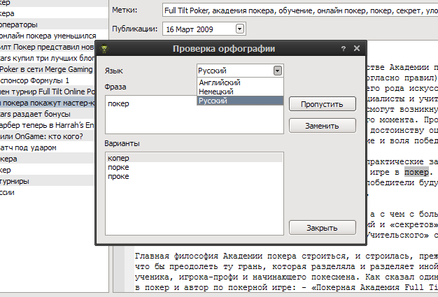
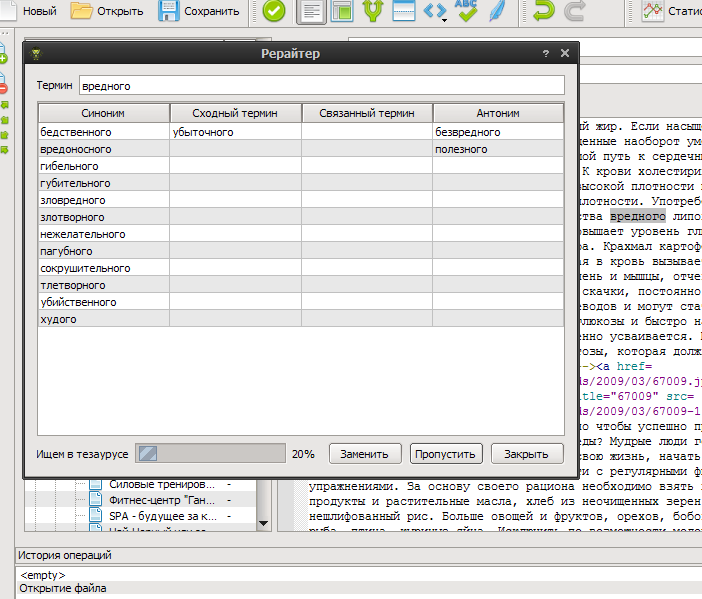

Статья
=======

Обработка одной статьи

Добавить вступление
-------------------
Добавляет вступление к статье. Если выбран текст, то копирует его в поле вступления.

Разделить на две
----------------
Разделяет статью на две по позиции курсора. В качестве заголовка второй статьи берется предложение(до точки) от позиции курсора.

Автонарезка
-----------
Нарезка текущей статьи на категории/статьи.

.. image:: images/articles_autosplit.png

Количество статей в категории выбирается случайно из заданного промежутка для каждой категории отдельно. Разбивка, по умолчанию, идет по предложениям(см. регулярное выражение). Название категории - соответствует названию первой статьи.

Проверка орфографии
-------------------
Проводит проверку орфографии в текущем окне редактора.

Доступны следующие языки:

* Русский
* Английский
* Немецкий

Вставка HTML тегов
-------------------
Добавляет вокруг выделенного текста указанный тег.

* Bold
* Italic
* Underline
* Strong
* Emphasis
* Link
* Image
* Unordered List
* List element
* Paragraph
* Break line

Рерайтер
--------

Рерайтер текста.

Содержит базу *русской* морфологии и тезаурус.

.. note::
    Процесс определения формы слова довольно нетривиален, поэтому возможны ошибки при генерации по тезаурусу. В этом случае исправьте термин вручную.

.. glossary::

    Статья
        Статья - страница
