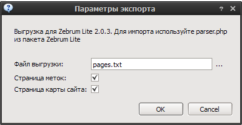

Экспорт
=======

CMS Simple
----------
Сохраняет HTML файл в формате CMS Simple с форматированием H1-8.

Экспортируемые поля:

* Заголовок
* Текст

WordPress XML
-------------

Выгружает XML в формате Wordpress Import.

Экспортируемые поля:

* Категории
* Теги
* Заголовок
* Дата публикации
* Текст
* Вступление(Excerpt)

.. note::
    Для импорта в WordPress версии 3.* установите плагин `wordpress-importer <http://wordpress.org/extend/plugins/wordpress-importer/>`_

WordPress XML-RPC(WP/metaWeblog)
--------------------------------

Экспортирует категории/статьи по XML-PRC. 

.. image:: images/export_wprpc.png

Поля для категорий:

* Заголовок
* Описание

Поля для статей:

* Заголовок
* Текст
* Дата публикации
* Теги

.. note::
    Протестировать подключение вы можете кнопкой Apply.

Joomla 1.5
----------

Выгрузка SQL файла в формате CMS Joomla 1.5

.. image:: images/export_joomla.png

Создается секция "Статьи". Далее в ней создаются категории. 

Поля для категорий:

* Заголовок
* Описание

Поля для статей:

* Имя автора
* Заголовок
* Вступительный текст
* Текст
* Дата публикации
* Теги

При необходимости генерируется код очистки секций/категорий/статей.

.. warning::
    Это может повлечь за собой удаление всех существующих материалов сайта.

Datalife Engine 8
-----------------

Выгрузка в SQL файла в форматах DLE 8.0/8.5.

Создается структура категории/статьи.

Поля для категорий:

* Заголовок

Поля для статей:

* Имя автора
* Дата публикации
* Заголовок
* Вступительный текст
* Текст
* Теги

При необходимости генерируется код очистки секций/категорий/статей.

.. warning::
    Это может повлечь за собой удаление всех существующих материалов сайта.

Zebrum Lite
-----------

Выгрузка в формате parser.php Zebrum Lite 2.0.3

Поля для категорий:

* Заголовок
* Дата публикации

Поля для статей:

* Заголовок
* Дата публикации
* Вступительный текст
* Текст
* Теги

Статичный сайт
--------------

Генерация статичного сайта. Подходит для размещения на хостингах без поддержки php(narod.ru).

.. image:: images/export_static.png

Создается структура каталогов содержащих HTML файлы по заданному шаблону. Поддерживаются метки:

* Заголовок
* Меню
* Содержимое
* Случайные статьи

.. note::
    Если вы получаете ошибку о невозможности создания файла на локальном диске, сократите вложенность каталогов, так как файловая система OS имеет ограничение на длину пути в 255 символов.

Livejournal.com
---------------

Выгрузка статей на сервис livejournal.com.

Экспортируемые поля:

* Заголовок
* Текст
* Дата публикации
* Теги

.. warning::
    При небольшом времени задержки между публикациями возможны санкции со стороны сервиса(блокирование доступа).

.. note::
    Протестировать подключение вы можете кнопкой Apply.

Blogger.com
-----------

Выгрузка статей на сервис blogspot.com

.. image:: images/export_blogger.png

Экспортируемые поля:

* Заголовок
* Текст
* Дата публикации
* Теги

.. warning::
    При небольшом времени задержки между публикациями возможны санкции со стороны сервиса(блокирование доступа).

.. note::
    Протестировать подключение вы можете кнопкой Apply.

Content Monster 2 XML-PRC
-------------------------

Выгрузка статей по XML-RPC.

.. image:: images/export_cm2xmlrpc.png

Вызываемые функции:

================  ====================  ================================
Функция           Действие              Параметры
================  ====================  ================================
check_connection  Проверка подключения  Входные:
                                        
                                        * нет
                                        
                                        Выходные: 
                                        
                                        * result(boolean) - результат
                                        
new_article       Добавление статьи     Входные:

                                        * parent(str) - заголовок категории
                                        * title(str) - заголовок статьи
                                        * text(str) - текст статьи
                                        * tags(array) - список тегов
                                        * date(date) - дата публикации
                                        
                                        Выходные: 
                                        
                                        * result(boolean) - результат
                                        
================  ====================  ================================

Пример сервера.

.. code-block:: python

    #!/usr/bin/env python
    # -*- coding: UTF-8 -*-

    __author__ = "snoa"

    from SimpleXMLRPCServer import SimpleXMLRPCServer
    import xmlrpclib
    import logging

    log = logging.getLogger(__name__)

    def new_article(parent, title, text, tags, pubdate):
        log.debug("""NEW ARTICLE
        title:   %s
        parent:  %s
        textlen: %i
        tags:    %i
        pubdate: %s
        """, title, parent, len(text), len(tags), pubdate)
        return True

    def check_connection():
        return True

    server = SimpleXMLRPCServer(("localhost", 8000))
    log.debug("Listening on port 8000...")
    server.register_function(check_connection)
    server.register_function(new_article)
    server.serve_forever()

.. note::
    Протестировать подключение вы можете кнопкой Apply.

Экспорт текстовых файлов
------------------------

Выгрузка статей в указанный каталог

Публикация материалов в UCOZ
----------------------------

Выгрузка статей в указанную категорию новостей

.. image:: images/export_ucoz.png

Для побликации в другие компоненты смотрите исходный код.

.. image:: images/export_ucoz2.png

.. warning::
    При публикации большого количества материалов возможны санкции.

.. note::
    * На сайте должен активирован модуль "новости сайта" и туда добавлена категория.(thx Dendroid)
    * На сайте после авторизации долна быть доступна страница "/news/0-0-0-0-1"

Экспорт в MaxSite CMS
---------------------

Выгрузка в формат демонстрационных данных: demo.sql

Экспорт в RSS Feed
---------------------

Выгрузка в формат RSS Feed

Экспортируемые поля:

* Заголовок
* Текст
* Дата публикации

Экспорт в Datalife Engine 9.0
-----------------------------

Выгрузка в DLE 9.0 SQL

.. note::
    Если вы используете базу в cp1251, то для импорта sql-файла используйте mysql с параметром --default-character-set utf8. Вот примерно так: *mysql --default-character-set utf8 -b dle9 <dle90.sql*

.. glossary::

    Экспорт
        Выгрузка статей в различны форматы и CMS
