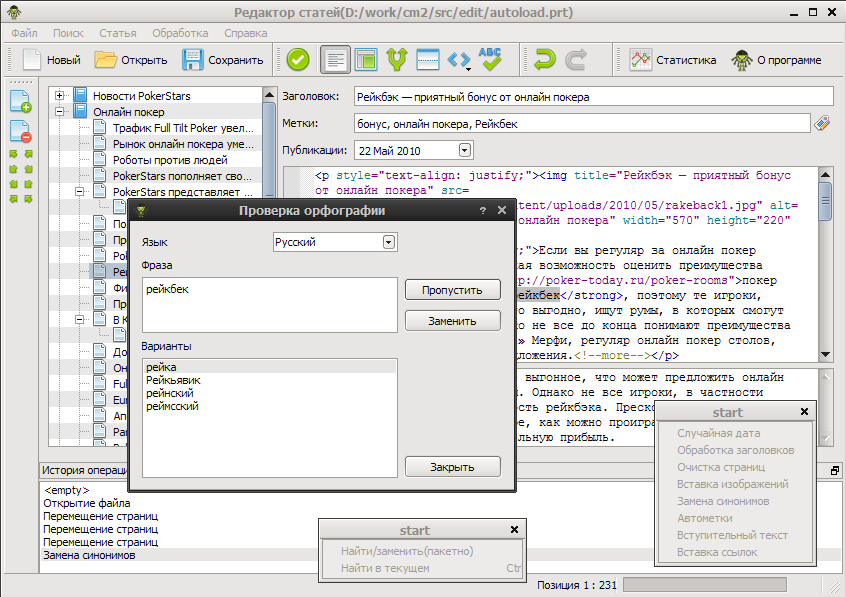

.. CM2 TreeEdit documentation master file, created by
   sphinx-quickstart on Fri Aug 27 12:47:32 2010.
   You can adapt this file completely to your liking, but it should at least
   contain the root `toctree` directive.

Документация CM2 TreeEdit's!
========================================

Добро пожаловать
----------------

..  toctree::
    :maxdepth: 1

    changes
    roadmap
    faq
    links

Основные функции
----------------

* подсветка html синтаксиса
* drag'n'drop
* откат изменений
* импорт и экспорт различных форматов
* встроенный синонимайзер

Описание возможностей
---------------------

..  toctree::
    :maxdepth: 2

    import
    export
    mysearch
    articles
    process
    other
