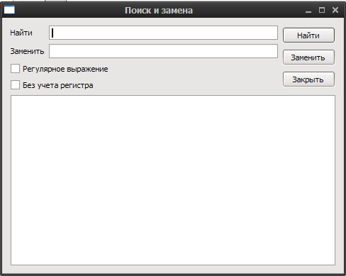
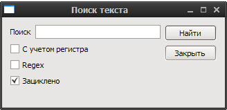

Поиск
=====

Пакетный поиск
--------------

Поиск/замена ведутся по выделенным статьям(заголовок, вступление, текст), возможно использование регулярных выражений. При двойном щелчке на список замен, открывается указанная статья.

.. note::

    Пример удаление ссылок из текстов от Susanin:
    Конкретно для чистки урлов, выбираете "Поиск и замена":
    Поиск: (((file|news|nntp|telnet|http|ftp|https|ftps|sftp)://)|(www\.))+(([a-zA-Z0-9\._-]+\.[a-zA-Z]{2,6})|([0-9]{1,3}\.[0-9]{1,3}\.[0-9]{1,3}\.[0-9]{1,3}))(/[a-zA-Z0-9\&amp;%_\./-~-]*)?
    Поставьте галку "Регулярное выражение"

Найти в текущей статье
----------------------

Поиск ведется по текущей статье и вступительному тексту, возможно использование регулярных выражений.

.. glossary::

    Поиск
        Поиск и замена фрагментов текста в статьях
