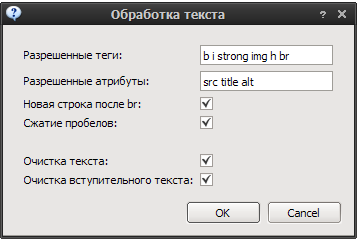
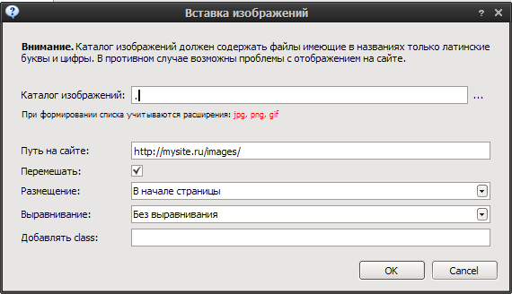

Обработка
=========

.. note::
    Если статьи не выбраны то обрабатываются все статьи.
    Выбрать все статьи можно сочетанием клавиш **Ctrl+A**

Переименование файлов изображений
---------------------------------

Плагин переименовывает файлы изображений в указанном каталоге.
см. `урок работы с плагином <http://content-monster.com/tutor/renamer.html>`_

Случайная дата
--------------

Устанавливает для статьи случайную дату из указанного диапазона.

.. image:: images/process_randomdates.png

Если отключено **Пермешивать** то статьи публикуются в порядке указанном в программе

Генерация заголовков статей
---------------------------

Генерация заголовков из фрагмента текста до *разделителя*. При необходимости проводиться небольшая уникализации удалением *прилагательных*.

.. image:: images/process_autotitles.png

Используются словари словоформ на трех языках(ru/en/de).

Обработка заголовков статей
---------------------------

Очистка заголовков статей от HTML тегов, изменение длины, исправление регистра букв(Капитализация).

Очистка страниц
---------------

Обработка страниц, удаление лишних пробелов, запрещенных HTML тегов.

.. note::
    Очистка заголовков удаляет все теги

Вставка изображений
-------------------

Вставка ссылок на изображения из указанного каталога.

Вставка ссылок на изображения происходит циклически. В качестве атрибутов ALT и TITLE тега IMG указывается заголовок статьи. Возможно добавление своего атрибута CLASS для управления стилями.

.. note::
    В названиях изображений допустимы только цифры и латинские буквы.

Замена синонимов
----------------

Обработка текста с использованием словарей YASyn.

.. image:: images/process_syno.png

Есть встроенный словарь на 80000 словоформ. Возможно использование стоп-слов.

Автометки
---------

Автоматическая генерация меток для статей на основе стеммера.

.. image:: images/process_autotags.png

Работа с тремя языками, русским, английским и немецким. Импорт списка меток в формате Wordpress Translator. 

Для работы необходимо выполнить следующие шаги:

* Генерация лемм с указанной длиной и частотой вхождений
* Удаление лишних, дописывание окончаний слов
* Запуск обработки статей

Вступительный текст
-------------------

Генерация вступительного текста к статье из текста.

Возможно указание длины вступительного текста и необходимость очистки тегов.

Вставка ссылок
--------------

Вставка ссылок с статью

.. image:: images/process_insertlinks.png

Возможно чтение ссылок из текстового файла(TXT) и карты сайта(XML, XML.GZ). Так-же можно указать либо количество ссылок на статью, либо равномерное распределение всех ссылок по статьям.

Циклическая вставка строк в статьи
----------------------------------

Плагин вставки строк в статьи.

Вставка возможна в начале статьи, в конце или с использованием регулярного выражения.

PHP плагин "Зачистка контента"
------------------------------

.. code-block:: php

    <?php
    require_once 'strip_tags_smart.php';
    require_once 'html_paragraph.php';

    print("Обрабатываем <b>$title</b>");
    $text = html_paragraph(strip_tags_smart ($text));

    ?>

PHP плагин "Удаление вложенных и непарных тэгов"
------------------------------------------------

.. code-block:: php

    <?php
    require_once 'html_tags_normalize.php';
    print("Обрабатываем <b>$title</b>");
    $text = html_tags_normalize ($text,$NoDeleteError,$DeleteError);
    $NoDelet=count($NoDeleteError);
    $Delet=count($DeleteError);
    print( "Исправлено:$Delet, неисправлено:$NoDelet ошиб." );
    if ($NoDelet != 0)
    {
      for ($i=0; $i<$NoDelet; $i++)
      {
        $myNoDeleteError =$NoDeleteError[$i];
        print ("<b>Ошибка $1</b> - $myNoDeleteError");
        }
      }
    ?>

Проверка уникальности статей
----------------------------

Диалог проверки статей на уникальность.

Настройка параметров проверки

.. image:: images/process_unic1.png

Окно соответствий

.. image:: images/process_unic2.png

Проверка содержимого

.. image:: images/process_unic3.png

Гобонизация
-----------

Плагин вставки Gobo Tooltip.

.. note::
    Необходимы базы в gob или ods формате

PHP плагин "Расстановка русских кавычек"
----------------------------------------

.. code-block:: php

    <?php
    require_once 'kawychka_function.php';
    
    print("Start <b>$title</b>");
    $text = kavych($text);
    $title = kavych($title);
    $intro = kavych($intro);
    print("done");
    ?>
    

.. glossary::

    Обработка
        Различная обработка указанных статей
