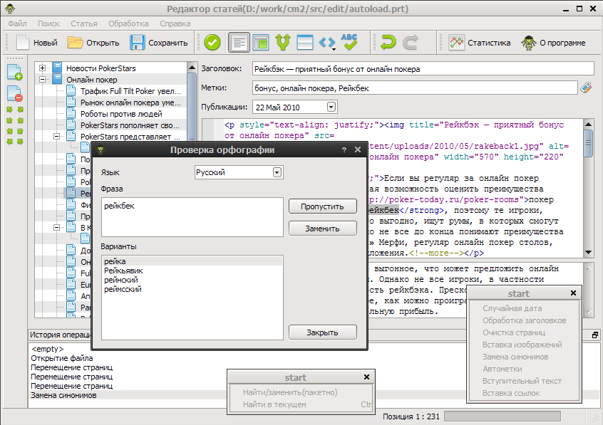
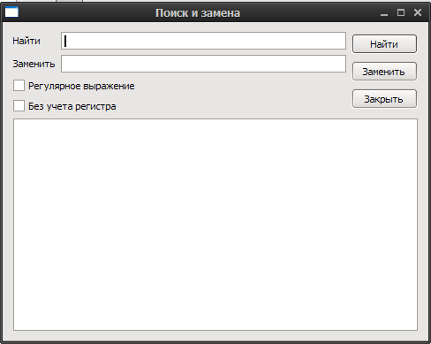

.. header:: Content Monster 2
.. |date| date:: %Y
.. |copy| unicode:: 0xA9 .. copyright sign
.. footer:: |copy| |date| blap.ru

Content Monster 2 TreeEdit
==========================

Основные функции
----------------

* подсветка html синтаксиса
* drag'n'drop
* откат изменений
* импорт и экспорт различных форматов
* встроенный синонимайзер

Поиск
-----

Пакетный поиск
~~~~~~~~~~~~~~

Поиск/замена ведутся по выделенным статьям(заголовок, вступление, текст), возможно использование регулярных выражений. При двойном щелчке на список замен, открывается указанная статья.

Найти в текущей статье
~~~~~~~~~~~~~~~~~~~~~~

.. image:: images/search_find.png

Поиск ведется по текущей статье и вступительному тексту, возможно использование регулярных выражений.

Часто задаваемые вопросы
------------------------

Какова должна быть структура
~~~~~~~~~~~~~~~~~~~~~~~~~~~~

Обычно используется простая вложенность типа `Категория-Статья`. Для того что-бы сделать статью
вложненной достаточно ее переместить мышкой в нужную категорию.

.. image:: images/struct.png

.. note::

    Content Monster 2 поддерживает многократную вложенность статей.

Установленная программа не запускается
~~~~~~~~~~~~~~~~~~~~~~~~~~~~~~~~~~~~~~

При возникновении такого сообщения

Необходимо установить Microsoft Visual C++ 2008 Redistributable Package который можно скачать по `ссылке <http://www.microsoft.com/downloads/details.aspx?FamilyID=9b2da534-3e03-4391-8a4d-074b9f2bc1bf&displaylang=ru>`_.

Статьи не обрабатываются
~~~~~~~~~~~~~~~~~~~~~~~~

Что-бы обработать статьи, их необходимо выбрать. Для того что-бы выбрать все статьи
требуется нажать `Ctrl+A` либо иконку `звездочка` на панели инструментов. Статьи можно выделять по одной или списком
используя клавиши `Ctrl` и `Shift`.

Размещение файла отчета
~~~~~~~~~~~~~~~~~~~~~~~

На Windows 7 файл отчет располагается `c:\\Users\\ИмяПользователя\\AppData\\Local\\treeedit\\cm2te.log`

Различные полезные ссылки
~~~~~~~~~~~~~~~~~~~~~~~~~

* `Сайт Wordpress Translator <http://blap.ru/>`_
* `СЕО Механик <http://lipf.ru/>`_
